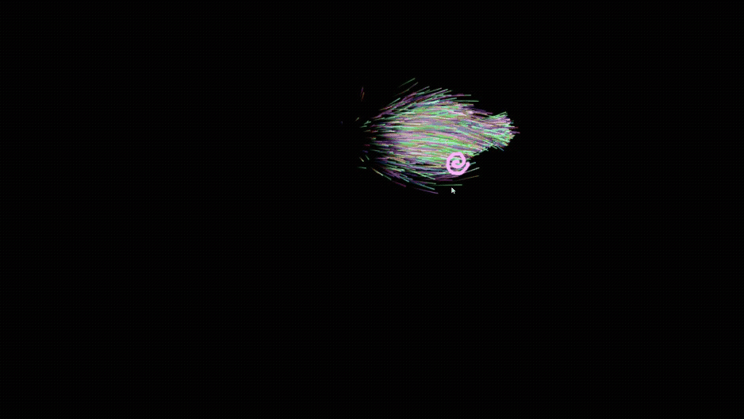

# Particles Using Rust and WebAssembly

[Try the demo here](https://austinclem1.github.io)

Thank you to the [Rust and WebAssembly Working Group](https://github.com/rustwasm/team) for creating tools like [wasm-bindgen](https://github.com/rustwasm/wasm-bindgen) and their many helpful usage examples.